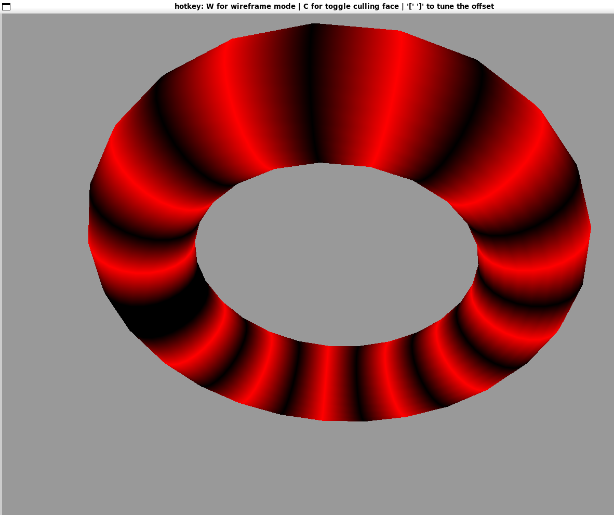
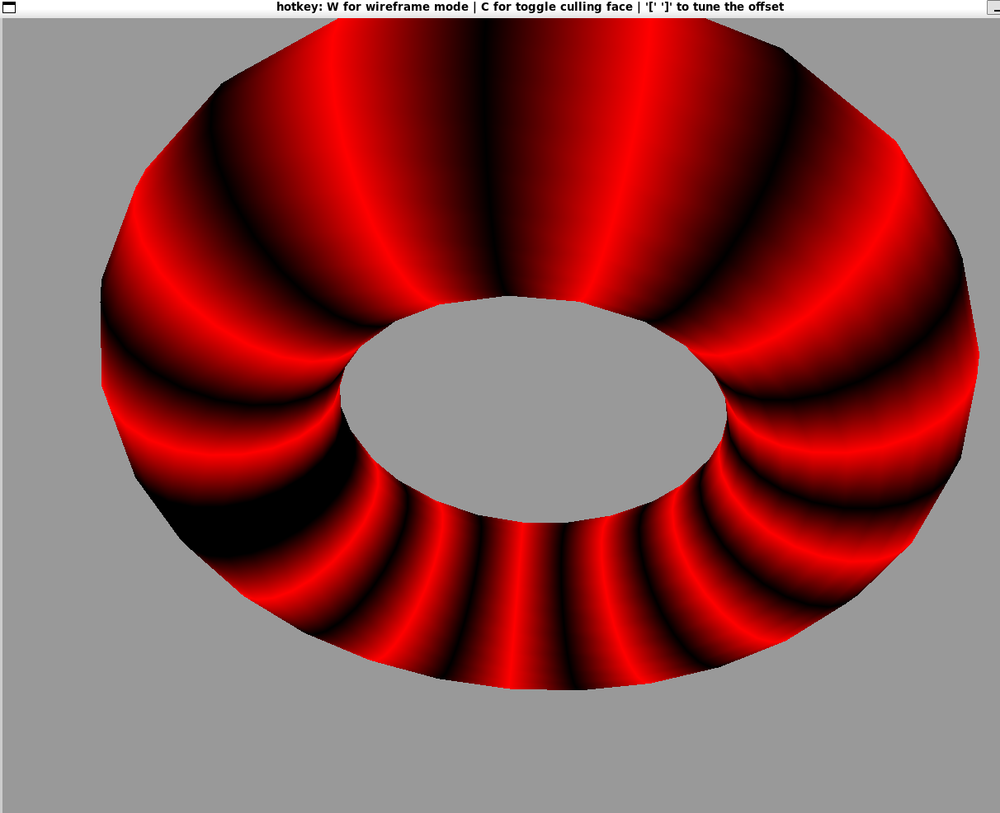

## Description
Through `glfwSetKeyCallback`, I make that program interactable. In detail, the program can respond to those hotkeys. 

| hotkey | description                                                  |
| ------ | ------------------------------------------------------------ |
| `w`    | enable/disable the wireframe mode.                           |
| `c`    | change the culling mode. (culling is disabled by default, first press is to enable it. After that, the following press is to alter between the frontface  backface culling) |
| `[`    | decrease the offset                                          |
| `]`    | increase the offset                                          |
| `q`    | quit                                                         |

To achieve the offset change interaction, I did not implement the offset inside the torus constructor, but made it a `glUniform1f` and write the offset calculation in the vertex shader program so that whenever the offset value is changed by the user, the vertex position will update and re-render.

## Screen Short
`R:10 r:3 offset:-0.5 segments_torus:25 segments_tube:25`

`R:10 r:3 offset:+0.5 segments_torus:25 segments_tube:25`

