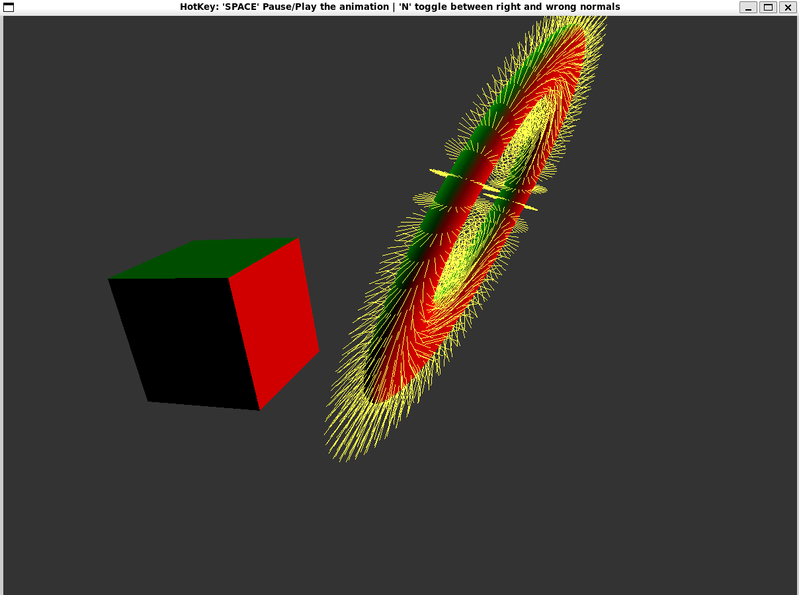
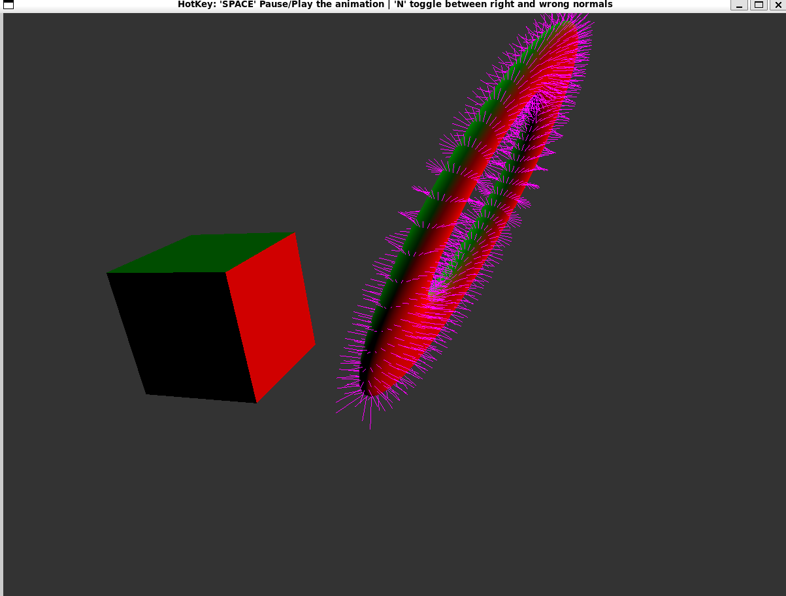

## Description

### Hotkey

Through `glfwSetKeyCallback`, I make that program interactable. In detail, the program can respond to those hotkeys. 

| hotkey  | description                                                  |
| ------- | ------------------------------------------------------------ |
| `N`     | shift between right and wrong normals. (yellow is wrong, pink is right) |
| `SPACE` | play or pause the animation.                                 |
| `q`     | quit                                                         |

### Normal Object Drawing

Since we have the origin normal vector $T$ for each vertex $P$ of the torus. So the normal line $PQ$ can be defined with 2 points $P$ and $Q=P+sT$ , where s is the scale that determine the length of the line.

When the torus are transformed by multiply a model view matrix $M$, we get a new $P'=MP$ and $Q'=MP+sMT$, if the upper left subpart of $M$ are not orthogonal (e.g. scale is applied), the perpendicularity between $P'Q'$ and the torus surface are not exist anymore. The new normal vector should be $T'=NT=(M^{-1})^T T$, where $N$ is what we call normal matrix. So we should shift the wrong endpoint $Q'$ to the right one $Q'_{N}=P'+T'=MP+NT$.

In implementation, we should firstly calculate the right endpoint of the normal line and pass it to the VAO, then in the shader program, we apply the model view transform to each vertex, $Q'_N$  is no exception.  But as we can see, the normal matrix $N$ is dependent with the model view matrix $M$. So we should update the position of the endpoint whenever the $M$ changes, and multiply the inverse of $M$ in advance before it changed by the shader.

- $Q_{temp}=P+M^{-1}NT$ (see detail in MultiLine::updateNormalDisplay)
- $Q'_{N}=MQ_{temp}=MP+NT$ (see detail in Normals.vert)

### Result

Wrong normal

Right normal

